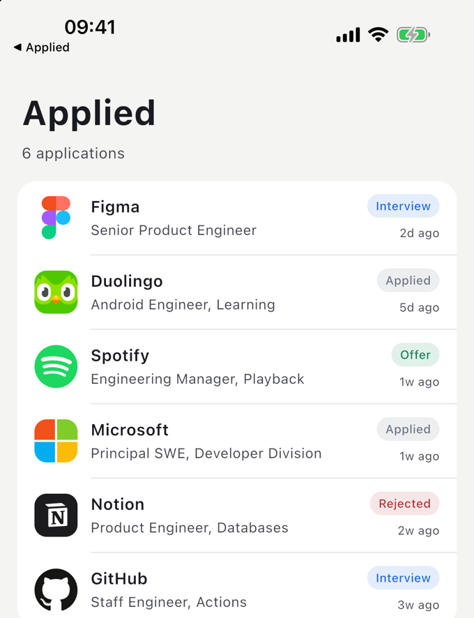
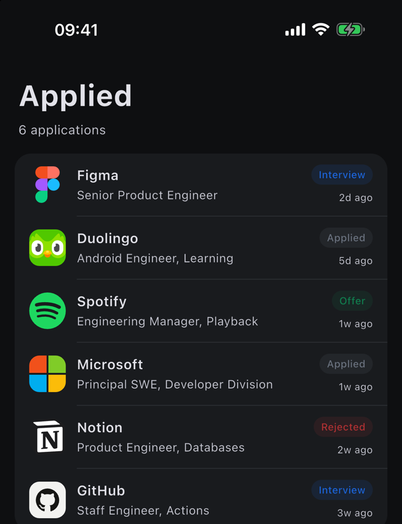

# brand_icons

[](https://dart.dev)
[](https://flutter.dev)
[](LICENSE)

**Brand icons, instantly, with no network call.**

Fetching a company logo normally means someone else's API: a round trip you wait on, a key to
keep, a bill that grows with your users, a rate limit, an outage you cannot fix, and a third party
who now knows every company your users look at.

This is a local lookup. **4,309 brands are compiled in**, so an icon costs about **10 microseconds**
and cannot fail, throttle, or phone anyone. It works offline.

<p align="center">
  
  
</p>

## Why not just…

**…call a logo API?** Latency on every icon, a key to manage, a bill per lookup, a rate limit, and
an outage you cannot fix. This is a function call against memory.

**…ship an icon set and look these up yourself?** An icon set gives you files, keyed by exact slug.
It does not answer "which brand is `APPLE.COM/BILL SPOTIFY`", which is the actual work.

**…use a store search?** Apple's is wrapped here as an optional tier. Google publishes no equivalent
public search API, so there is no Play tier.

**…just take the top match?** That is how you silently draw the wrong logo. `Amazon` matches two
Amazon sub brands at exactly the same score, and the honest answer is to ask.

## What you get

- **4,309 marks**, 3,175 of them in full colour. No network, no key, no rate limit.
- A score built from token overlap and structure rather than one fuzzy distance.
- `isAmbiguous()`, so a coin flip becomes a chooser instead of a wrong icon.
- A `BrandIcon` widget that draws vector marks, raster artwork or a monogram.

## Install

```yaml
dependencies:
  brand_icons: ^1.0.0
```

## Use

```dart
import 'package:brand_icons/brand_icons.dart';

final resolver = await BrandIconResolver.bundled();

final result = await resolver.resolve(BrandQuery('APPLE.COM/BILL SPOTIFY'));
final icon = result.best(minimum: 0.8);
```

The package finds and parses its own catalogue and memoises it, so awaiting `bundled` again is
free. Pass your own `BrandCatalog` to the constructor if you ship your own marks.

To draw the answer:

```dart
BrandIcon(candidate: icon, fallbackText: company, size: 40)
```

## What it costs your app

The catalogue is the whole point and the whole weight: it is vector geometry for 4,309 brands, and
nothing else in the package is measurable beside it.

| | brands | in your bundle |
| --- | --- | --- |
| full | 4,309 | **2.44 MB** |
| compact | 4,087 | **1.65 MB** |

Those are the compressed sizes, which is what an app store actually ships.

The compact catalogue leaves out 222 marks whose path data runs past 4 KB. Those are
illustrations rather than icons, detailed enough to be mush at 40 points, and they are what makes
the difference. Everything else is identical, including every score.

## It takes the names you actually have

The lookup is a resolver, not a filename match, so a string that came off a bank statement or a
user's typing still finds the brand:

```
"APPLE.COM/BILL SPOTIFY"   →   Spotify      1.00
"NOTION LABS INC"          →   Notion       0.81
"SQ *BLUE BOTTLE"          →   nothing      —
"Amazon"                   →   two sub brands tie, ask the user
```

## Acting on the score

```dart
final result = await resolver.resolve(BrandQuery('Amazon'));

if (result.best(minimum: 0.8) != null) {
  draw(result.candidates.first);
} else if (result.isAmbiguous()) {
  askTheUser(result.candidates);
}
```

| Score | Meaning |
| --- | --- |
| 1.00 | the normalised names are identical |
| 0.72 – 0.90 | the query is the brand plus extra words, like a statement descriptor |
| 0.42 – 0.60 | the brand is more specific than the query. `Apple` is not `Apple TV` |
| below 0.35 | discarded rather than returned |

## Offline by default

```dart
final resolver = BrandIconResolver(catalog, configuration: ResolverConfiguration.offline);
```

## Agreeing with the other platforms

This port is not written to a specification and hoped over. Two fixtures generated by the Swift
implementation are checked in and asserted against:

- `golden-corpus.json` — queries with their normalised key, brand tokens and scored candidates
- `golden-geometry.json` — element kinds and every control point of a set of marks

`flutter test` also parses every path in the catalogue, because the geometry fixture pins twenty
marks and says nothing about the other four thousand.

| Platform | Repository |
| --- | --- |
| Flutter, Dart | this repository |
| iOS and macOS, Swift | [infiniah/brand-icons-ios](https://github.com/infiniah/brand-icons-ios) |
| Android, Kotlin | [infiniah/brand-icons-android](https://github.com/infiniah/brand-icons-android) |
| React Native and Expo, TypeScript | [infiniah/brand-icons-expo](https://github.com/infiniah/brand-icons-expo) |

## Example app

`example/` is a job application tracker that resolves an icon for every company.

```sh
cd example && flutter run
```

## License

MIT for the code. The marks carry their own terms: Simple Icons is CC0, the colour artwork is CC0
and MIT, and none of it touches trademark. See [NOTICE](NOTICE).
